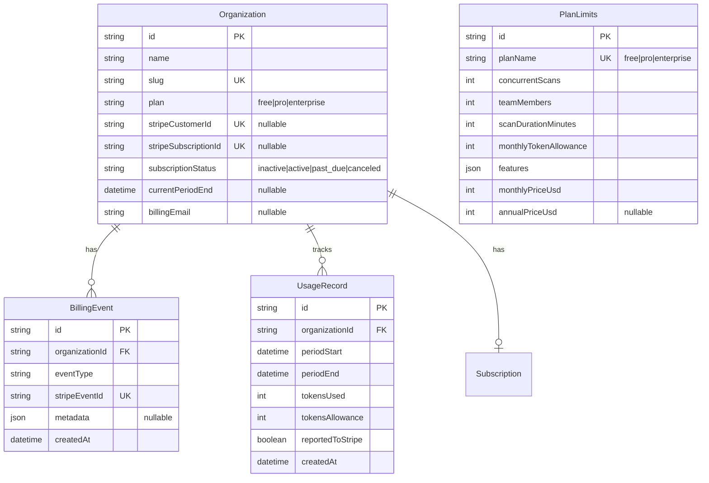

# Data Model: Billing & Subscriptions

**Feature**: 010-billing
**Date**: 2026-01-19

## Entity Relationship Diagram



## Entities

### Organization (Extended)

Extends the existing Organization model with billing-related fields.

| Field | Type | Constraints | Description |
|-------|------|-------------|-------------|
| stripeCustomerId | String? | Unique | Stripe customer ID for API calls |
| stripeSubscriptionId | String? | Unique | Active subscription ID |
| subscriptionStatus | String | Default: "inactive" | active, past_due, canceled, inactive |
| currentPeriodEnd | DateTime? | - | When current billing period ends |
| billingEmail | String? | - | Optional billing contact override |

**Validation Rules**:
- `stripeCustomerId` must be valid Stripe customer ID format (cus_*)
- `stripeSubscriptionId` must be valid Stripe subscription ID format (sub_*)
- `subscriptionStatus` must be one of: inactive, active, past_due, canceled

**State Transitions**:

```
inactive → active (checkout completed)
active → past_due (payment failed)
active → canceled (subscription deleted)
past_due → active (payment succeeded)
past_due → canceled (max retries exceeded)
canceled → active (new subscription created)
```

### BillingEvent

Audit trail for all billing lifecycle events. Ensures idempotent webhook processing.

| Field | Type | Constraints | Description |
|-------|------|-------------|-------------|
| id | String | PK, cuid | Unique identifier |
| organizationId | String | FK → Organization | Owner organization |
| eventType | String | Required | Type of billing event |
| stripeEventId | String | Unique | Stripe event ID for deduplication |
| metadata | Json? | - | Event-specific data |
| createdAt | DateTime | Default: now() | When event was recorded |

**Event Types**:
- `checkout_started` - User initiated checkout
- `checkout_completed` - Payment successful, plan upgraded
- `payment_succeeded` - Recurring payment processed
- `payment_failed` - Payment attempt failed
- `subscription_updated` - Plan changed mid-cycle
- `subscription_canceled` - Subscription ended
- `usage_reported` - Token usage reported to Stripe

**Metadata Examples**:

```json
// checkout_completed
{
  "plan": "pro",
  "interval": "monthly",
  "amount": 9900,
  "currency": "usd"
}

// payment_failed
{
  "attemptCount": 2,
  "lastError": "card_declined",
  "nextRetry": "2026-01-22T00:00:00Z"
}
```

### UsageRecord

Tracks LLM token consumption per organization per billing period.

| Field | Type | Constraints | Description |
|-------|------|-------------|-------------|
| id | String | PK, cuid | Unique identifier |
| organizationId | String | FK → Organization | Owner organization |
| periodStart | DateTime | Required | Billing period start |
| periodEnd | DateTime | Required | Billing period end |
| tokensUsed | Int | Default: 0 | Cumulative tokens consumed |
| tokensAllowance | Int | Required | Plan-based allowance |
| reportedToStripe | Boolean | Default: false | Whether overage reported |
| createdAt | DateTime | Default: now() | Record creation time |

**Validation Rules**:
- `periodStart` must be before `periodEnd`
- `tokensUsed` must be >= 0
- Unique constraint on (organizationId, periodStart)

### PlanLimits (Configuration Table)

Static configuration for plan-based limits. Seeded via migration.

| Field | Type | Constraints | Description |
|-------|------|-------------|-------------|
| id | String | PK, cuid | Unique identifier |
| planName | String | Unique | free, pro, enterprise |
| concurrentScans | Int | Required | Max simultaneous scans |
| teamMembers | Int | Required | Max team members (use MAX_INT for unlimited) |
| scanDurationMinutes | Int | Required | Max scan runtime |
| monthlyTokenAllowance | Int | Required | Included tokens/month |
| features | Json | Required | Feature flags |
| monthlyPriceUsd | Int | Required | Price in cents |
| annualPriceUsd | Int? | - | Annual price in cents |

**Seed Data**:

```json
[
  {
    "planName": "free",
    "concurrentScans": 1,
    "teamMembers": 1,
    "scanDurationMinutes": 30,
    "monthlyTokenAllowance": 50000,
    "features": {
      "customReports": false,
      "apiAccess": false,
      "scheduledScans": false
    },
    "monthlyPriceUsd": 0,
    "annualPriceUsd": null
  },
  {
    "planName": "pro",
    "concurrentScans": 3,
    "teamMembers": 5,
    "scanDurationMinutes": 60,
    "monthlyTokenAllowance": 500000,
    "features": {
      "customReports": true,
      "apiAccess": false,
      "scheduledScans": true
    },
    "monthlyPriceUsd": 9900,
    "annualPriceUsd": 99000
  },
  {
    "planName": "enterprise",
    "concurrentScans": 10,
    "teamMembers": 2147483647,
    "scanDurationMinutes": 120,
    "monthlyTokenAllowance": 5000000,
    "features": {
      "customReports": true,
      "apiAccess": true,
      "scheduledScans": true
    },
    "monthlyPriceUsd": 0,
    "annualPriceUsd": null
  }
]
```

## Prisma Schema

```prisma
// Extend Organization model
model Organization {
  // ... existing fields ...

  // Billing fields
  stripeCustomerId     String?   @unique
  stripeSubscriptionId String?   @unique
  subscriptionStatus   String    @default("inactive")
  currentPeriodEnd     DateTime?
  billingEmail         String?

  // Relations
  billingEvents        BillingEvent[]
  usageRecords         UsageRecord[]

  @@index([subscriptionStatus])
  @@index([currentPeriodEnd])
}

model BillingEvent {
  id             String   @id @default(cuid())
  organizationId String
  eventType      String
  stripeEventId  String   @unique
  metadata       Json?
  createdAt      DateTime @default(now())

  organization   Organization @relation(fields: [organizationId], references: [id], onDelete: Cascade)

  @@index([organizationId])
  @@index([eventType])
  @@index([createdAt])
}

model UsageRecord {
  id               String   @id @default(cuid())
  organizationId   String
  periodStart      DateTime
  periodEnd        DateTime
  tokensUsed       Int      @default(0)
  tokensAllowance  Int
  reportedToStripe Boolean  @default(false)
  createdAt        DateTime @default(now())

  organization     Organization @relation(fields: [organizationId], references: [id], onDelete: Cascade)

  @@unique([organizationId, periodStart])
  @@index([organizationId])
  @@index([periodEnd])
}

model PlanLimits {
  id                    String  @id @default(cuid())
  planName              String  @unique
  concurrentScans       Int
  teamMembers           Int
  scanDurationMinutes   Int
  monthlyTokenAllowance Int
  features              Json
  monthlyPriceUsd       Int
  annualPriceUsd        Int?
  createdAt             DateTime @default(now())
  updatedAt             DateTime @updatedAt
}
```

## Indexes

| Table | Index | Purpose |
|-------|-------|---------|
| Organization | stripeCustomerId (unique) | Webhook customer lookup |
| Organization | subscriptionStatus | Find past_due subscriptions |
| Organization | currentPeriodEnd | Find expiring subscriptions |
| BillingEvent | stripeEventId (unique) | Idempotent webhook processing |
| BillingEvent | organizationId + createdAt | Billing history queries |
| UsageRecord | organizationId + periodStart (unique) | Prevent duplicate periods |
| UsageRecord | periodEnd | Find completed periods for Stripe reporting |

## Migration Strategy

### Phase 1: Add Billing Fields (Zero Downtime)

```sql
-- Add nullable fields to Organization
ALTER TABLE "Organization"
  ADD COLUMN "stripeCustomerId" TEXT,
  ADD COLUMN "stripeSubscriptionId" TEXT,
  ADD COLUMN "subscriptionStatus" TEXT NOT NULL DEFAULT 'inactive',
  ADD COLUMN "currentPeriodEnd" TIMESTAMP(3),
  ADD COLUMN "billingEmail" TEXT;

-- Add indexes
CREATE UNIQUE INDEX "Organization_stripeCustomerId_key"
  ON "Organization"("stripeCustomerId") WHERE "stripeCustomerId" IS NOT NULL;
CREATE UNIQUE INDEX "Organization_stripeSubscriptionId_key"
  ON "Organization"("stripeSubscriptionId") WHERE "stripeSubscriptionId" IS NOT NULL;
CREATE INDEX "Organization_subscriptionStatus_idx" ON "Organization"("subscriptionStatus");
CREATE INDEX "Organization_currentPeriodEnd_idx" ON "Organization"("currentPeriodEnd");
```

### Phase 2: Create New Tables

```sql
-- BillingEvent table
CREATE TABLE "BillingEvent" (
  "id" TEXT NOT NULL,
  "organizationId" TEXT NOT NULL,
  "eventType" TEXT NOT NULL,
  "stripeEventId" TEXT NOT NULL,
  "metadata" JSONB,
  "createdAt" TIMESTAMP(3) NOT NULL DEFAULT CURRENT_TIMESTAMP,

  CONSTRAINT "BillingEvent_pkey" PRIMARY KEY ("id"),
  CONSTRAINT "BillingEvent_stripeEventId_key" UNIQUE ("stripeEventId"),
  CONSTRAINT "BillingEvent_organizationId_fkey"
    FOREIGN KEY ("organizationId") REFERENCES "Organization"("id") ON DELETE CASCADE
);

CREATE INDEX "BillingEvent_organizationId_idx" ON "BillingEvent"("organizationId");
CREATE INDEX "BillingEvent_eventType_idx" ON "BillingEvent"("eventType");
CREATE INDEX "BillingEvent_createdAt_idx" ON "BillingEvent"("createdAt");

-- UsageRecord table
CREATE TABLE "UsageRecord" (
  "id" TEXT NOT NULL,
  "organizationId" TEXT NOT NULL,
  "periodStart" TIMESTAMP(3) NOT NULL,
  "periodEnd" TIMESTAMP(3) NOT NULL,
  "tokensUsed" INTEGER NOT NULL DEFAULT 0,
  "tokensAllowance" INTEGER NOT NULL,
  "reportedToStripe" BOOLEAN NOT NULL DEFAULT false,
  "createdAt" TIMESTAMP(3) NOT NULL DEFAULT CURRENT_TIMESTAMP,

  CONSTRAINT "UsageRecord_pkey" PRIMARY KEY ("id"),
  CONSTRAINT "UsageRecord_organizationId_periodStart_key"
    UNIQUE ("organizationId", "periodStart"),
  CONSTRAINT "UsageRecord_organizationId_fkey"
    FOREIGN KEY ("organizationId") REFERENCES "Organization"("id") ON DELETE CASCADE
);

CREATE INDEX "UsageRecord_organizationId_idx" ON "UsageRecord"("organizationId");
CREATE INDEX "UsageRecord_periodEnd_idx" ON "UsageRecord"("periodEnd");

-- PlanLimits table (seeded)
CREATE TABLE "PlanLimits" (
  "id" TEXT NOT NULL,
  "planName" TEXT NOT NULL,
  "concurrentScans" INTEGER NOT NULL,
  "teamMembers" INTEGER NOT NULL,
  "scanDurationMinutes" INTEGER NOT NULL,
  "monthlyTokenAllowance" INTEGER NOT NULL,
  "features" JSONB NOT NULL,
  "monthlyPriceUsd" INTEGER NOT NULL,
  "annualPriceUsd" INTEGER,
  "createdAt" TIMESTAMP(3) NOT NULL DEFAULT CURRENT_TIMESTAMP,
  "updatedAt" TIMESTAMP(3) NOT NULL,

  CONSTRAINT "PlanLimits_pkey" PRIMARY KEY ("id"),
  CONSTRAINT "PlanLimits_planName_key" UNIQUE ("planName")
);
```

### Phase 3: Seed Plan Configuration

```sql
INSERT INTO "PlanLimits"
  ("id", "planName", "concurrentScans", "teamMembers", "scanDurationMinutes",
   "monthlyTokenAllowance", "features", "monthlyPriceUsd", "annualPriceUsd", "updatedAt")
VALUES
  (gen_random_uuid()::text, 'free', 1, 1, 30, 50000,
   '{"customReports":false,"apiAccess":false,"scheduledScans":false}', 0, NULL, NOW()),
  (gen_random_uuid()::text, 'pro', 3, 5, 60, 500000,
   '{"customReports":true,"apiAccess":false,"scheduledScans":true}', 9900, 99000, NOW()),
  (gen_random_uuid()::text, 'enterprise', 10, 2147483647, 120, 5000000,
   '{"customReports":true,"apiAccess":true,"scheduledScans":true}', 0, NULL, NOW());
```
